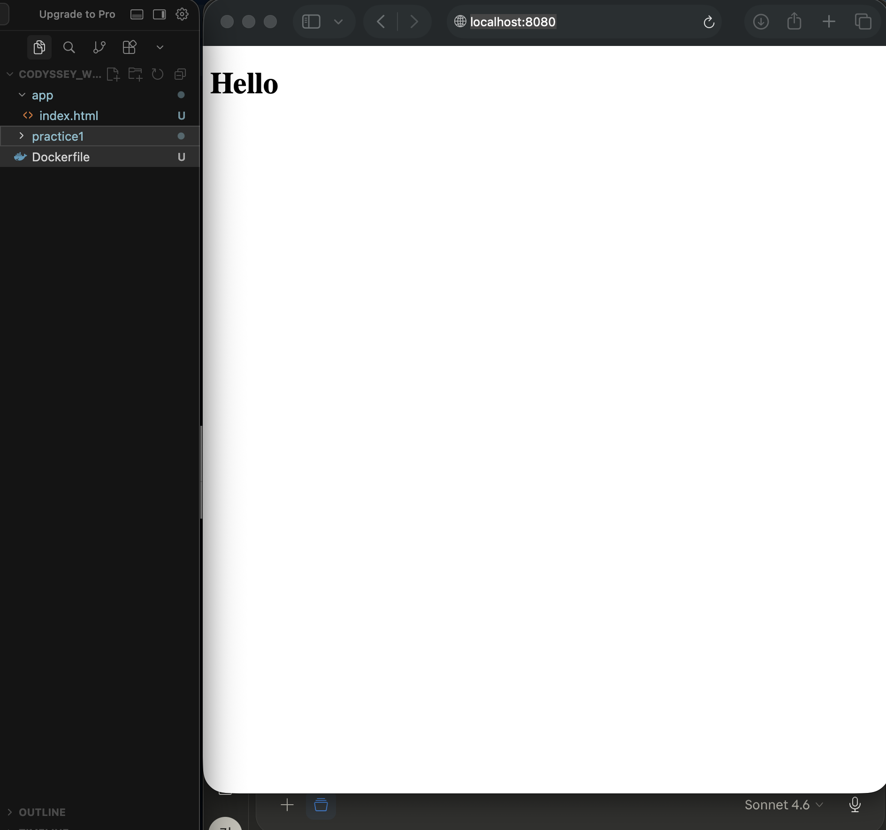

# Dockerfile 로그

## A번 - nginx 기반 웹서버

### 베이스 이미지
`nginx:alpine` - nginx 웹서버 이미지 중 용량이 가장 작은 버전

### Dockerfile
```dockerfile
FROM nginx:alpine          # nginx:alpine 이미지를 기반으로 시작
COPY app/ /usr/share/nginx/html/  # 내 HTML 파일을 nginx 웹서버 폴더에 복사
EXPOSE 80                  # 80번 포트 사용 선언
```

### 커스텀 포인트
| 항목 | 목적 |
|---|---|
| `FROM nginx:alpine` | 웹서버 환경 제공 + 용량 최소화 |
| `COPY app/` | 기본 nginx 페이지 대신 내 HTML로 교체 |
| `EXPOSE 80` | 웹서버 기본 포트 선언 |

### 빌드 및 실행
```bash
# 이미지 빌드
$ docker build -t my-web:1.0 .

# 포트 매핑으로 실행
$ docker run -d -p 8080:80 --name my-web my-web:1.0
```

### 포트 매핑 접속 증거



## B번 - ubuntu 기반 커스텀 환경

### 베이스 이미지
`ubuntu:22.04` - 순수 리눅스 베이스 이미지

### Dockerfile
```dockerfile
FROM ubuntu:22.04                          # ubuntu 22.04 기반으로 시작
RUN apt-get update && apt-get install -y curl  # curl 패키지 설치
ENV APP_ENV=dev                            # 환경변수 설정
HEALTHCHECK --interval=30s --timeout=3s \
  CMD curl --version || exit 1            # 헬스체크 추가
CMD ["bash"]                              # 컨테이너 실행시 bash 시작
```

### 커스텀 포인트
| 항목 | 목적 |
|---|---|
| `RUN apt-get install curl` | 패키지 설치 기능 추가 |
| `ENV APP_ENV=dev` | 환경변수 설정 |
| `HEALTHCHECK` | 컨테이너 정상 동작 여부 주기적 확인 |
| `CMD ["bash"]` | 실행시 자동으로 bash 터미널 시작 |

### 빌드 및 실행
```bash
# 이미지 빌드
$ docker build -t my-ubuntu:1.0 .

# 실행 후 환경변수 확인
$ docker run -it my-ubuntu:1.0
root@컨테이너ID:/# echo $APP_ENV
dev
root@컨테이너ID:/# curl --version
```