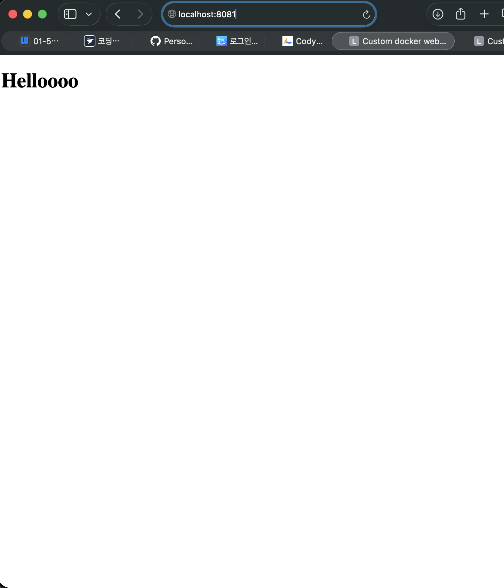
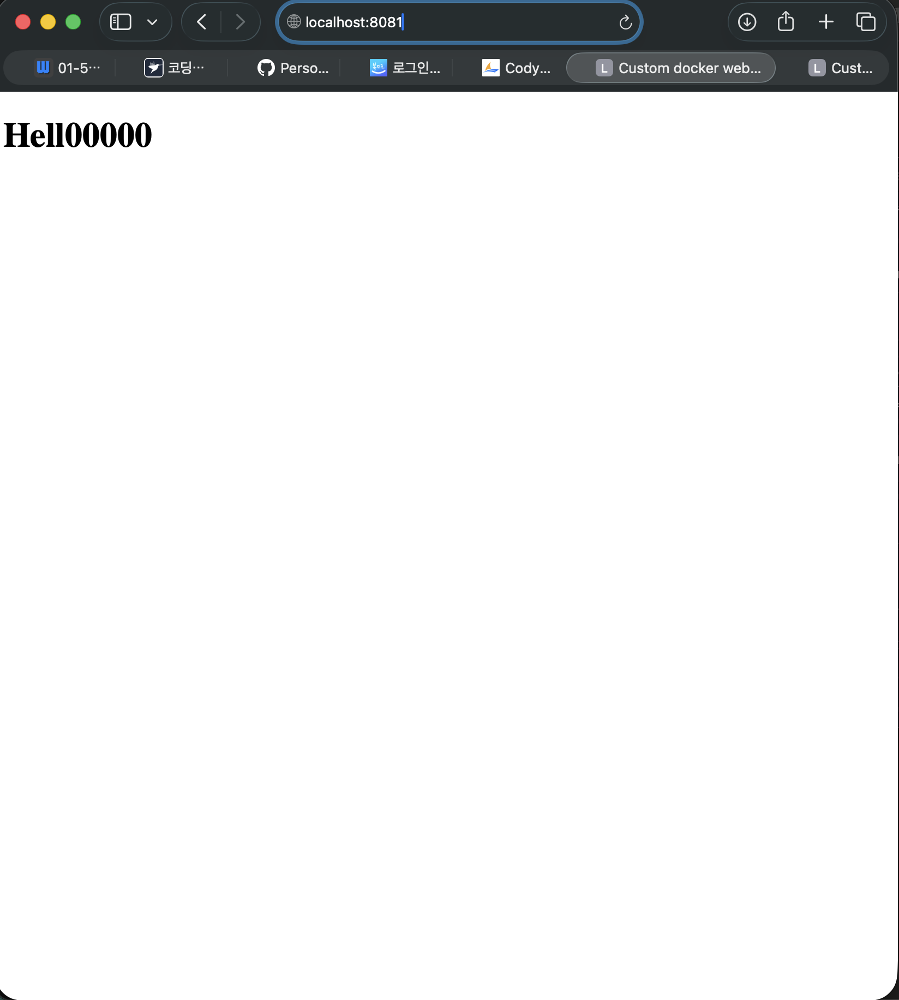

# 바인드 마운트 + 볼륨 로그

## 바인드 마운트

### 개념
내 맥북 폴더와 컨테이너 폴더를 실시간으로 연결하는 것.
파일을 수정하면 이미지 재빌드 없이 컨테이너에 바로 반영됨.

### 실행
```bash
# 바인드 마운트로 컨테이너 실행
# -v $(pwd)/app:/usr/share/nginx/html → 내 app 폴더를 컨테이너 nginx 폴더에 연결
$ docker run -d -p 8081:80 --name my-web-bind \
  -v $(pwd)/app:/usr/share/nginx/html nginx:alpine
```

### 변경 전/후 비교
- 변경 전: index.html 원본 내용
- app/index.html 수정 후 브라우저 새로고침
- 변경 후: 수정된 내용이 즉시 반영됨 (이미지 재빌드 없이)

### 스크린샷



## Docker 볼륨

### 개념
컨테이너를 삭제해도 데이터가 유지되는 Docker 관리 저장공간.

### 실행
```bash
# 볼륨 생성
$ docker volume create mydata

# 볼륨 목록 확인
$ docker volume ls

# 볼륨 연결해서 컨테이너 실행
# -v mydata:/data → mydata 볼륨을 컨테이너 /data 폴더에 연결
$ docker run -d --name vol-test1 -v mydata:/data ubuntu sleep infinity

# 컨테이너 안에서 데이터 저장
$ docker exec -it vol-test1 bash
root@컨테이너ID:/# echo "볼륨 테스트" > /data/hello.txt
root@컨테이너ID:/# cat /data/hello.txt
볼륨 테스트
root@컨테이너ID:/# exit

# 컨테이너 삭제
$ docker rm -f vol-test1

# 새 컨테이너에 같은 볼륨 연결
$ docker run -d --name vol-test2 -v mydata:/data ubuntu sleep infinity

# 데이터 유지 확인
$ docker exec -it vol-test2 bash
root@컨테이너ID:/# cat /data/hello.txt
볼륨 테스트  ← 컨테이너 삭제 후에도 데이터 유지됨
```